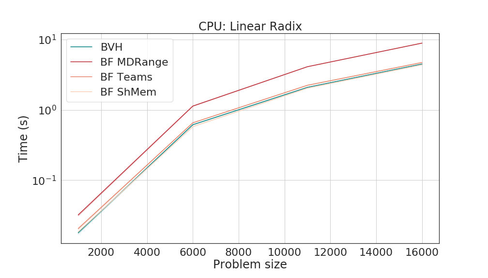

# Performance

## GPU performance

### Architecture

Runs on the ACCRE cluster at Vanderbilt on the `pascal` nodes.

```
GPU:                     Nvidia Pascal
CPU cores:               8 Intel Xeon E5-2623 v4 @ 2.60 GHz
CUDA cores (per GPU):    3584
Host memory:             128 GB
GPU memory:              12 GB
Shared memory (level 0): 40 MB
Network:                 56 Gbps RoCE 
```

### Collisions between spheres and points

*Fixed radix for the spheres*


*Linear increasing radix for the spheres*


*Logarithmic increasing radix for the spheres*


### Contact examples


## CPU performance

Same node but using the `OpenMP` execution space and the `HostSpace` memory space.

### Collisions between spheres and points

*Fixed radix for the spheres*


*Linear increasing radix for the spheres*



*Logarithmic increasing radix for the spheres*


